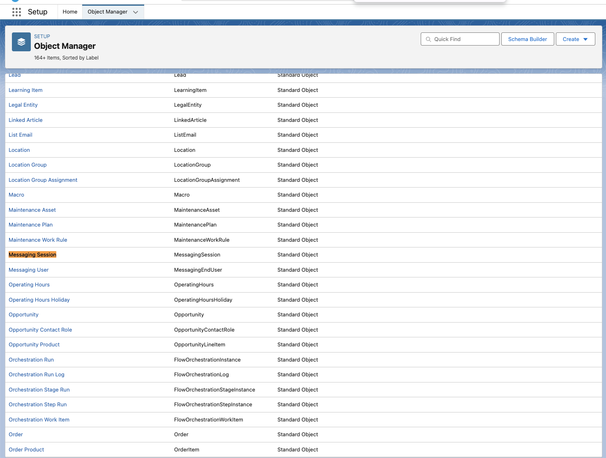
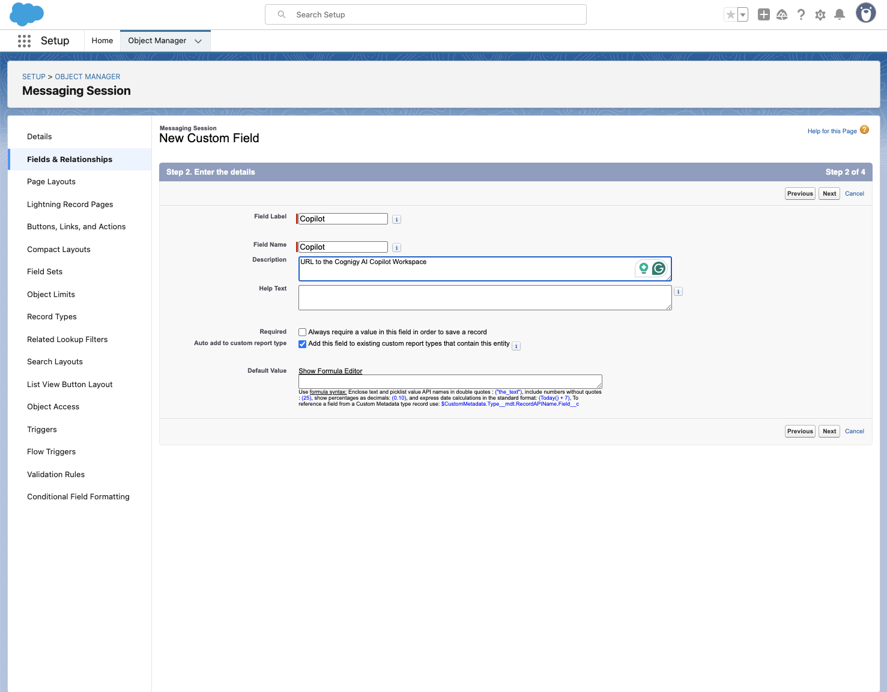
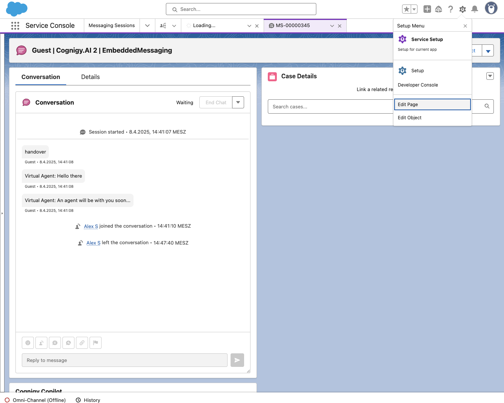

# Overview

This repository contains a collection of all components developed and provided by Cognigy to facilitate a seamless integration with Salesforce.

## Copilot Integration

This component will integrate Cognigy Copilot directly into Chat Layouts. [Demo](https://658d8d4043dc6727aed29fd1-cgdzcjhdkx.chromatic.com/?path=/story/copilotintegration--in-layout)

# Setup

## Download the source code

To start with, download a local copy of this repository onto your computer. Use git (`git clone https://github.com/Cognigy/salesforce-integrations.git`) or download and unpack it into a folder you can access again.

## Install CLI

Next, you need to install the Salesforce CLI. Find the installer here: https://developer.salesforce.com/tools/salesforcecli.

A full installation guide is available here: https://developer.salesforce.com/docs/atlas.en-us.sfdx_setup.meta/sfdx_setup/sfdx_setup_install_cli.htm

## Setup languages

The components have been built and tested on nodeJS version 21.4.0. You can check your version with `node -v`. Make sure you have a matching version number through your preferred installation method.

We recommend using [asdf](https://asdf-vm.com/), but this is optional. Proceed with [Fetch dependencies](#fetch-dependencies) if you already have the right node version. To use asdf:

1. Follow the installation guide: https://asdf-vm.com/guide/getting-started.html
2. Install the NodeJS plugin and install the right version by running the following command in a terminal window

```bash
asdf plugin-add nodejs
```

3. Restart your terminal
4. Open a terminal in the project root directory and run the following commands:

```bash
asdf install
```

## Fetch dependencies

1. Open a terminal in the `salesforce-integrations` folder
2. Run the following command `npm i`

# Installation

## Deploy component to Salesforce

### Authorize

To deploy the component into your Salesforce installation, you need to authorize it first. In your terminal:

1. Run `sf org login`
2. Chose a preferred authorization method
3. Done

### Deployment

After you have authorized the repository, you can deploy the included components into your Salesforce installation. This will enable you to drop Cognigy components into your Salesforce pages. It will not change any existing pages.

1. Open a shell in the project root directory.
2. Run `sf deploy`
3. Specify the org you want to deploy into. If you have kept to the instructions so far, only one organization should be selectable.
4. Hit enter.
5. Select `project deploy start` from the options.
6. Automated tests will run. If they are successful, the component will be deployed into your Salesforce instance.

ℹ️ If you encounter problems during this step, refer to the [Troubleshooting](#troubleshooting) section before contacting Cognigy support.

## Set up component

### Add custom field to Chat Transcript object

For the component to work, it relies on a custom field being present in the `Chat Transcript` object of Salesforce. To add this field:

1. Navigate to the `Object Manager` in your Salesforce installation, then open the `Chat Transcript` object.
   
2. Select the `Fields & Relations` Tab on the left side, click `New` on the top right to add a new field.
   
3. Select the `URL` data type and click `Next`.
   
4. Enter `Copilot` as the field name. Do not deviate from this in spelling or casing, as the Cognigy component relies on it. You may enter a description if you like. Click `Next`.
   
5. In the `Field security` section, do not change anything and click `Next`.
   
6. In the `Add to pages` section, make sure the `Chat Transcript` page is selected. Finish the field setup by clicking `Save`.
   

Click on the newly created `Copilot` field and confirm that the details are correct. It should look like this:


### Integrate into Livechats

Finally, the Cognigy component needs to be added to the Chat Transcript page, so it is accessible to agents.

1. Navigate to the `Chat Transcript` section of your Salesforce instance. Open any chat transcript. If you don't have any, you can create one by starting a chat with a test user.
2. Then, click on the Lightning cog and select `Edit Page`
   
3. On the left side of the editor, scroll down to the `Custom` section. Click and drag the `Cognigy Copilot` component into the page layout into the position you want it to appear in. Finish up by clicking save. Cognigy Copilot should now be available in all new conversations!
   

ℹ️ If you don't see the Cognigy Copilot after saving, make sure the page is properly activated. Refer to https://help.salesforce.com/s/articleView?id=sf.lightning_page_getting_into_salesforce1.htm&type=5 for details.

# Development

## VSCode

For a smooth developer experience, it is recommended to follow the Salesforce setup guide for Visual Studio Code: https://trailhead.salesforce.com/content/learn/projects/quick-start-lightning-web-components/set-up-visual-studio-code

## Linting

You can lint the project by running `npm run lint`

## Tests

The components in this repositories are developed under a test-driven approach. You can run the tests with `npm run test:unit`

## Sandbox

For demo purposes and maintaining visual consistency, the component(s) in this repository can be previewed in a sandboxed environment. To start it, run `npm run storybook`.

# Troubleshooting

## Test failures preventing deployment

In some cases, you might not be able to get the automated testing to run on your local machine. The error might look something like this:


To circumvent this, you can skip the testing stage and force a deployment. All components are tested by Cognigy before they are released. Unless you made changes to the source code, skipping the tests locally should not be an issue.

To force a deployment:

1. Open a terminal in the `salesforce-integrations` folder
2. Run the following command: `sfdx force:source:deploy -p force-app/main/default/lwc/copilotIntegration -u
your_login_username@example.com`

⚠️ Replace `your_login_username@example.com` with your actual username
