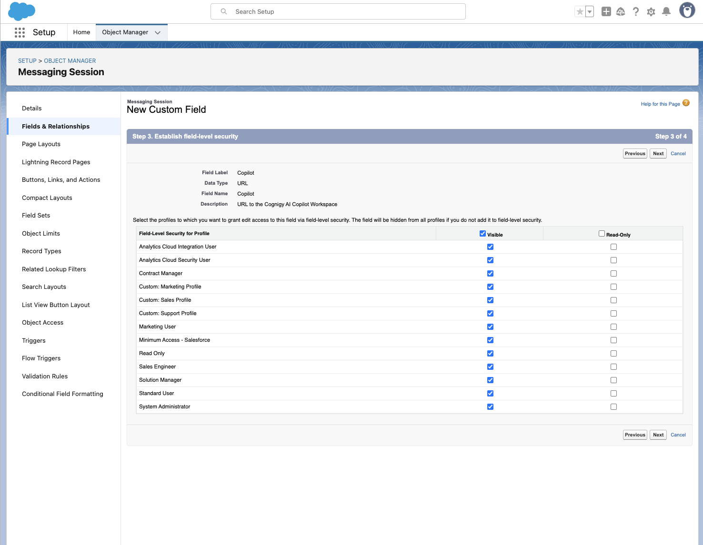

# Overview

This repository contains a collection of all components developed and provided by Cognigy to facilitate seamless integration with Salesforce.

## Copilot Integration

This new functionality will enable the seamless integration of Cognigy Copilot directly into Chat Layouts, allowing for a more streamlined and efficient experience. With this feature, users can easily access and utilize the powerful capabilities of Cognigy Copilot without having to navigate away from the conversation chat. To get a better idea of how this feature works, check out a [demo](https://658d8d4043dc6727aed29fd1-cgdzcjhdkx.chromatic.com/?path=/story/copilotintegration--in-layout).

# Setup

## Download the Source Code

To begin, download a local copy of this repository onto your computer. You can run [git clone](https://github.com/Cognigy/salesforce-integrations.git) in the terminal or download and unpack the repository into a folder for easy access later.

## Install CLI

Install the [Salesforce CLI](https://developer.salesforce.com/tools/salesforcecli). For a detailed installation guide, refer to the [Install Salesforce CLI](https://developer.salesforce.com/docs/atlas.en-us.sfdx_setup.meta/sfdx_setup/sfdx_setup_install_cli.htm) documentation.

## Set up Languages

All the components have been built and tested on Node.js version 21.4.0. You can check your version with the `node -v` command. Ensure that you have a matching version installed using your preferred method.

Although using [asdf](https://asdf-vm.com/) is recommended, it's optional. If you already have the correct version of Node.js, you can go ahead and [fetch dependencies](#fetch-dependencies).
If you want to use `asdf`, follow the instructions:

1. Refer to the [installation guide](https://asdf-vm.com/guide/getting-started.html).
2. Install the Node.js plugin and the correct version by executing the following command via the terminal:

   ```bash
   asdf plugin-add nodejs
   ```

3. Restart your terminal.
4. Open the terminal in the project root directory and run the following command:

   ```bash
   asdf install
   ```

## Fetch Dependencies

To fetch dependencies, follow these steps:

1. In the terminal, open in the `salesforce-integrations` folder.
2. Run the following command:
   ```bash
   npm i
   ```

All the dependencies are fetched.

# Installation

## Deploy a Component to Salesforce

### Authorize

To deploy a component into your Salesforce installation, you need to authorize it first:

1. In the terminal, run the following command:
   ```bash
   sf org login
   ```
2. Select a preferred authorization method.

Your component is authorized.

### Deploy

After the authorization, you can deploy the component into your Salesforce installation. This action will enable you to drop Cognigy components into your Salesforce pages. It will not change any existing pages.

1. In the terminal, open in the project root directory.
2. Run the following command:

   ```bash
   sf deploy
   ```

3. Specify the organization you want to deploy into. You can specify only one organization.
4. Press **Enter**.
5. From the list, select `project deploy start`.

Automated tests will run. After successful automated tests, the component will be deployed to your Salesforce instance.

> Note: If you encounter problems during this step, refer to the [Troubleshooting](#troubleshooting) section before contacting Cognigy technical support.

## Set up the Component

### Add a Custom Field to the Messaging Session object

To ensure the component functions properly, a custom field must be present in Salesforce's Messaging Session object. To add this field:

1. Navigate to the Object Manager in your Salesforce installation, then open the **Messaging Session** object.

   

2. Click **New** to add a new field next to the search field.

   

3. Select the **URL** data type and click **Next**.

   

4. In **Field Name** and **Field Lable**, specify `Copilot`. Ensure spelling and casing match exactly, as the Cognigy component relies on it. Optionally, provide a description. Then, click **Next**.

   

5. Do not change anything in the **Field security** section and click `Next`.

   

6. In the **Add to pages** section, ensure the **Messaging Session** page is selected.
7. Click **Save**.

   

8. Click the newly created **Copilot** field to ensure the details are correct. It should appear as follows:

   

### Integrate into Livechats

Finally, the Cognigy component needs to be added to the **Messaging Session** page to make it accessible to agents.

1. Navigate to the **Messaging Session** section of your Salesforce instance. Open any messaging session. If you don't have any, you can create one by starting a chat with a test user.
2. In the upper-right corner, click the **Gear** icon and select **Edit Page**.

   

3. On the left side of the editor, scroll down to the **Custom** section.
4. Click and drag the **Cognigy Copilot** component into the page layout, positioning it where you want it to appear.
5. Click **Save**. Cognigy Copilot should now be available in all new conversations.

   

> Note: If you don't see the Cognigy Copilot after saving, ensure the page is properly activated. For details, refer to the [Salesforce](https://help.salesforce.com/s/articleView?id=sf.lightning_page_getting_into_salesforce1.htm&type=5) documentation.

# Update

To update the component, run the following command:

```bash
sf deploy
```

The component will be updated in your Salesforce instance.

Be aware that this will not update the component in existing conversations. You will need to manually update the component in the **Messaging Session** page layout. To do so, follow the [Integrate into Livechats](#integrate-into-livechats) section.

# Development

## Visual Studio Code

For a smooth developer experience, follow the Salesforce setup guide for [Visual Studio Code](https://trailhead.salesforce.com/content/learn/projects/quick-start-lightning-web-components/set-up-visual-studio-code).

## Linting

You can lint the project by running the following command:

```bash
npm run lint
```

## Tests

The components in this repository are developed using a test-driven approach. You can run the tests with the following command:

```bash
npm run test:unit
```

## Sandbox

For demo purposes and to maintain visual consistency, the components in this repository can be previewed in a sandboxed environment.
To launch the sandbox, run the following command:

```bash
npm run storybook`
```

# Troubleshooting

## Test Failures Preventing Deployment

In certain cases, running automated tests on your local machine may not be possible. You might encounter an error similar to this:


If no changes were made to the source code, you can skip testing and force deployment. Cognigy tests all components before release.

To force deployment:

1. In the terminal, open the the `salesforce-integrations` folder.
2. Run the following command replacing `your_login_username@example.com` with your actual username:

   ```bash
   sfdx force:source:deploy -p force-app/main/default/lwc/copilotIntegration -u
   your_login_username@example.com`
   ```

   The changes will be applied.
